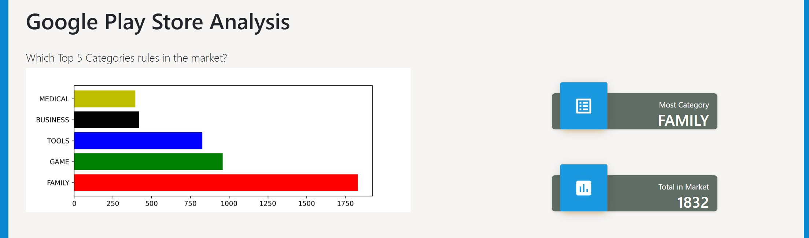
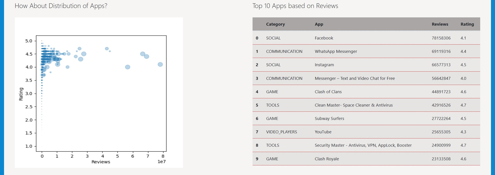
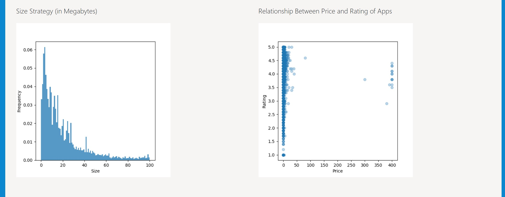

# 📱 Google Play Store Data Analytics Dashboard

An analytical dashboard that visualizes **key insights from Google Play Store apps**, built using **Python, Flask, Pandas, and Matplotlib**.






## 🚀 Overview

This project was developed as a **capstone project** for the **Data Analytics Specialization** at *Algoritma Data Science School*.  

It explores **patterns and trends among mobile applications**, focusing on category dominance, user engagement, app sizing strategies, and the relationship between price and rating.

### Dashboard Highlights

* 🏆 **Top 5 Categories in the Market** – The most popular app categories by count and total market presence.  
* ⭐ **App Performance Distribution** – Visualizes the relationship between app reviews and ratings, showing how user feedback aligns with performance.  
* 🧮 **Top 10 Apps Based on Reviews** – Lists the top 10 apps with the highest number of reviews, including category, app name, rating, and total reviews.  
* 📦 **Size Strategy (in Megabytes)** – Displays the distribution of app sizes, revealing optimization trends.  
* 💵 **Price vs. Rating Relationship** – Explores whether higher app prices correlate with better ratings.


## 🧩 Project Objectives

* Build a **clean and functional Flask dashboard** for app analytics.  
* Perform **exploratory data analysis (EDA)** on app ratings, sizes, prices, and installs.  
* Demonstrate **data cleaning, wrangling, and visualization** skills using Python.


## 📈 Key Insights

* **Top Categories:** *Family* dominates the market, showing high competition.  
* **User Ratings:** Most apps score between **4.0–4.5**, reflecting positive user experiences.  
* **Price vs. Rating:** Free apps show more diversity in ratings and higher installation counts.  
* **App Size Distribution:** Most apps are under **30MB**, highlighting developers’ focus on optimization.


## 🧱 Project Workflow
### 1. Environment Setup
a. **Create a virtual environment**

```bash
conda create -n capstone_DA python=3.10  
conda activate capstone_DA
```

b. **Install dependencies**
All required packages are listed in `requirements.txt`.

```bash
pip install -r requirements.txt --user
```

### 2. Data Preparation
a. **Data Cleansing**
* Removed duplicate and irrelevant records  
* Cleaned `Installs` and `Price` columns (removed symbols such as “+” and “,”)  
* Converted columns to appropriate numeric data types
  
b. **Data Wrangling**
* Grouped data by category for total installs, average ratings, and price distribution  
* Generated summary statistics for visualizations  
* Prepared data for dashboard rendering  

### 3. Data Visualization
Created four visualizations using **Matplotlib**:
* **Bar Chart:** Top 5 app categories  
* **Scatter Plot:** Reviews vs. Ratings (bubble size = installs)  
* **Histogram:** App size distribution  
* **Scatter Plot:** Price vs. Rating  

### 4. Flask Dashboard Development
* Rendered visualizations dynamically using Flask templates (`index.html`)  
* Designed a clean, minimalist HTML layout for dashboard presentation  


## 📂 Dataset Summary
| Variable       | Description                      |
| -------------- | -------------------------------- |
| App            | Application name                 |
| Category       | App category                     |
| Rating         | Average user rating              |
| Reviews        | Number of user reviews           |
| Size           | App size (MB)                    |
| Installs       | Number of installs               |
| Type           | Free or Paid                     |
| Price          | App price                        |
| Content Rating | Target age group                 |
| Genres         | App genre                        |
| Last Updated   | Last update date                 |
| Current Ver    | Current version                  |
| Android Ver    | Minimum Android version required |


## ⚙️ Technical Stack
* **Language:** Python  
* **Framework:** Flask  
* **Libraries:** Pandas, NumPy, Matplotlib  
* **IDE:** Visual Studio Code  


## 💡 Why This Project Matters
This project demonstrates the ability to analyze and visualize real-world data using Python and Flask.  By exploring app trends, user ratings, and category insights, it showcases end-to-end data analytics skills, from cleaning and wrangling raw data to deploying a structured, visual dashboard.


## 👩🏻‍💻 Author  
**Zahra Nur Anisah** – Data Science Enthusiast  
Passionate about transforming raw data into meaningful business insights through analytics and visualization.  

📧 **Email:** [zahranuranisah@gmail.com](mailto:zahranuranisah@gmail.com)  
💼 **LinkedIn:** [linkedin.com/in/zahranuranisah](https://www.linkedin.com/in/zahranuranisah)  

